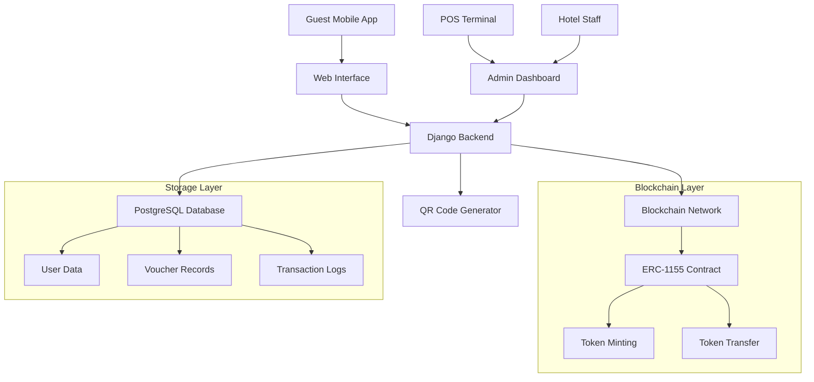
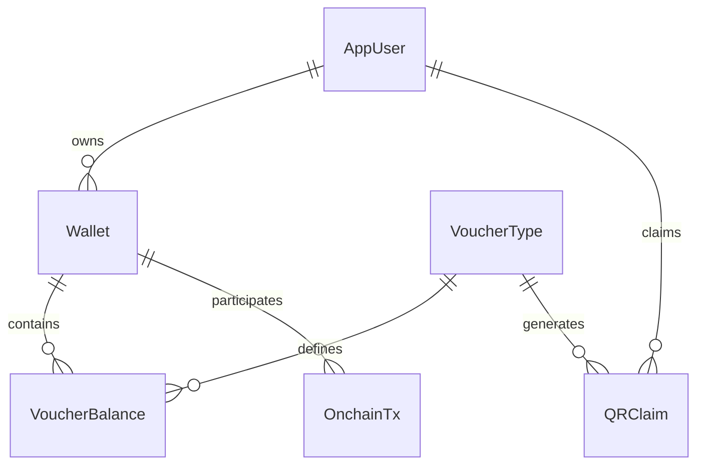

# 🏨 Furama StayToken

> **Digital Voucher System for Furama Resort Guests**  
> A blockchain-powered voucher management platform that enables seamless digital voucher distribution, redemption, and transfer for hotel guests.

[](https://djangoproject.com/)
[](https://python.org/)
[](https://eips.ethereum.org/EIPS/eip-1155)
[](LICENSE)

---

## 🎯 **Purpose & Vision**

Furama StayToken revolutionizes the traditional paper voucher system by leveraging blockchain technology to create a secure, transparent, and user-friendly digital voucher ecosystem. This system addresses the pain points of physical voucher management while providing guests with a modern, convenient experience.

### **Why Digital Vouchers?**

- **🌍 Environmental Impact**: Eliminates paper waste and reduces carbon footprint
- **🔒 Security**: Blockchain ensures tamper-proof voucher authenticity
- **📱 Convenience**: Mobile-first approach for modern travelers
- **🔄 Transferability**: Seamless voucher sharing between guests
- **📊 Analytics**: Real-time tracking and insights for hotel management
- **⚡ Speed**: Instant redemption at point-of-sale terminals

---

## ✨ **Key Features**

### 🎫 **Voucher Management**
- **Digital Voucher Creation**: Generate unique, blockchain-backed vouchers
- **QR Code Integration**: Secure QR codes for easy redemption
- **Multi-format Support**: Various voucher types (spa, dining, activities)
- **Expiration Management**: Time-based voucher validity

### 👥 **User Experience**
- **Guest Portal**: Intuitive interface for voucher management
- **Mobile-Optimized**: Responsive design for all devices
- **QR Scanner**: Camera-based voucher scanning
- **Wallet Integration**: Personal digital wallet for voucher storage

### 🏪 **Point of Sale (POS)**
- **Terminal Management**: Multi-terminal support for different outlets
- **Real-time Validation**: Instant voucher verification
- **Redemption Tracking**: Complete audit trail of voucher usage
- **Staff Interface**: User-friendly POS dashboard

### 🔗 **Blockchain Integration**
- **ERC-1155 Tokens**: Industry-standard multi-token contract
- **On-chain Minting**: Secure voucher creation on blockchain
- **Transfer Support**: Peer-to-peer voucher sharing
- **Transaction History**: Immutable redemption records

### 🔐 **Security & Compliance**
- **Rate Limiting**: Prevents abuse and spam
- **User Authentication**: Secure guest identification
- **Data Privacy**: GDPR-compliant data handling
- **Audit Logs**: Comprehensive activity tracking

---

## 🏗️ **System Architecture**



---

## 🚀 **Quick Start**

### **Prerequisites**
- Python 3.13+
- PostgreSQL 12+
- Node.js 16+ (for frontend assets)
- Git

### **Installation**

1. **Clone the repository**
   ```bash
   git clone https://github.com/furama-resort/staytoken.git
   cd staytoken
   ```

2. **Set up virtual environment**
   ```bash
   python -m venv venv
   source venv/bin/activate  # On Windows: venv\Scripts\activate
   ```

3. **Install dependencies**
   ```bash
   pip install -r requirements.txt
   ```

4. **Configure environment**
   ```bash
   cp .env.example .env
   # Edit .env with your configuration
   ```

5. **Set up database**
   ```bash
   python manage.py migrate
   python manage.py createsuperuser
   ```

6. **Run development server**
   ```bash
   python manage.py runserver
   ```

### **Environment Configuration**

| Variable | Description | Example |
|----------|-------------|---------|
| `SECRET_KEY` | Django secret key | `your-secret-key-here` |
| `DEBUG` | Debug mode | `True` |
| `DB_NAME` | Database name | `furama_staytoken` |
| `ST_RPC_URL` | Blockchain RPC URL | `https://mainnet.infura.io/v3/...` |
| `ST_ERC1155_SIGNER` | Private key for minting | `0x...` |
| `ST_DEFAULT_CONTRACT` | ERC-1155 contract address | `0x...` |
| `ST_CHAIN_ID` | Blockchain chain ID | `1` (Ethereum mainnet) |

---

## 📱 **User Flows**

### **Guest Journey**
1. **Registration**: Guest creates account with email/phone
2. **Voucher Claim**: Scan QR code or enter claim code
3. **Wallet Management**: View and manage digital vouchers
4. **Redemption**: Show QR code at POS terminal
5. **Transfer**: Share vouchers with other guests

### **Staff Workflow**
1. **Terminal Setup**: Configure POS terminals for different outlets
2. **Voucher Validation**: Scan guest QR codes for verification
3. **Redemption Processing**: Complete voucher redemption
4. **Reporting**: Generate usage analytics and reports

---

## 🔧 **Technical Stack**

### **Backend**
- **Django 5.2**: Web framework
- **PostgreSQL**: Primary database
- **Web3.py**: Blockchain integration
- **QRCode**: QR code generation
- **Cryptography**: Security utilities

### **Frontend**
- **Alpine.js**: Lightweight JavaScript framework
- **Tailwind CSS**: Utility-first CSS framework
- **HTML5 Canvas**: QR code scanning
- **Responsive Design**: Mobile-first approach

### **Blockchain**
- **ERC-1155**: Multi-token standard
- **Ethereum**: Primary blockchain network
- **Web3 Integration**: Smart contract interaction
- **Gas Optimization**: Efficient transaction handling

---

## 📊 **Database Schema**

### **Core Models**
- **AppUser**: Guest and staff user accounts
- **Wallet**: Digital wallet for voucher storage
- **VoucherType**: Voucher templates and metadata
- **VoucherBalance**: User voucher holdings
- **QRClaim**: Unique claim codes for vouchers
- **OnchainTx**: Blockchain transaction records

### **Key Relationships**


---

## 🛡️ **Security Features**

### **Authentication & Authorization**
- **Multi-factor Authentication**: Email/phone verification
- **Session Management**: Secure user sessions
- **Role-based Access**: Different permissions for guests/staff
- **API Key Management**: Secure POS terminal authentication

### **Data Protection**
- **Encryption**: Sensitive data encryption at rest
- **Rate Limiting**: API abuse prevention
- **Input Validation**: SQL injection protection
- **CORS Configuration**: Cross-origin request security

### **Blockchain Security**
- **Private Key Management**: Secure key storage
- **Transaction Signing**: Cryptographic transaction verification
- **Smart Contract Audits**: Regular security assessments
- **Gas Limit Controls**: Prevent excessive transaction costs

---

## 📈 **Performance & Scalability**

### **Optimization Strategies**
- **Database Indexing**: Optimized query performance
- **Caching**: Redis for session and data caching
- **CDN Integration**: Static asset delivery
- **Database Connection Pooling**: Efficient connection management

### **Monitoring & Analytics**
- **Real-time Metrics**: System performance tracking
- **Error Logging**: Comprehensive error monitoring
- **Usage Analytics**: Voucher redemption insights
- **Performance Alerts**: Automated system monitoring

---

## 🚀 **Deployment**

### **Production Setup**
1. **Server Configuration**: Ubuntu 20.04+ recommended
2. **Database Setup**: PostgreSQL with replication
3. **Web Server**: Nginx with Gunicorn
4. **SSL Certificate**: Let's Encrypt for HTTPS
5. **Monitoring**: Prometheus + Grafana

### **Docker Deployment**
```bash
# Build and run with Docker Compose
docker-compose up -d

# Scale services
docker-compose up -d --scale web=3
```

### **Cloud Deployment**
- **AWS**: EC2, RDS, S3, CloudFront
- **Google Cloud**: Compute Engine, Cloud SQL, CDN
- **Azure**: App Service, Database, CDN
- **Heroku**: Platform-as-a-Service deployment

---

## 🤝 **Contributing**

We welcome contributions! Please see our [Contributing Guidelines](CONTRIBUTING.md) for details.

### **Development Setup**
1. Fork the repository
2. Create a feature branch
3. Make your changes
4. Add tests for new functionality
5. Submit a pull request

### **Code Standards**
- **Python**: PEP 8 style guide
- **JavaScript**: ESLint configuration
- **Documentation**: Comprehensive docstrings
- **Testing**: Unit and integration tests

---

## 📄 **License**

This project is licensed under the MIT License - see the [LICENSE](LICENSE) file for details.

---

## 🆘 **Support & Contact**

- **Documentation**: [docs.furama-staytoken.com](https://docs.furama-staytoken.com)
- **Issues**: [GitHub Issues](https://github.com/furama-resort/staytoken/issues)
- **Email**: support@furama-staytoken.com
- **Discord**: [Community Server](https://discord.gg/furama-staytoken)

---

## 🙏 **Acknowledgments**

- **Ethereum Foundation**: For blockchain infrastructure
- **Django Community**: For the excellent web framework
- **Open Source Contributors**: For the amazing tools and libraries
- **Furama Resort Team**: For vision and support

---

<div align="center">

**Built with ❤️ for the future of hospitality**

[🏨 Furama Resort](https://furama.com) • [📱 StayToken](https://staytoken.com) • [🌐 Documentation](https://docs.staytoken.com)

</div>
